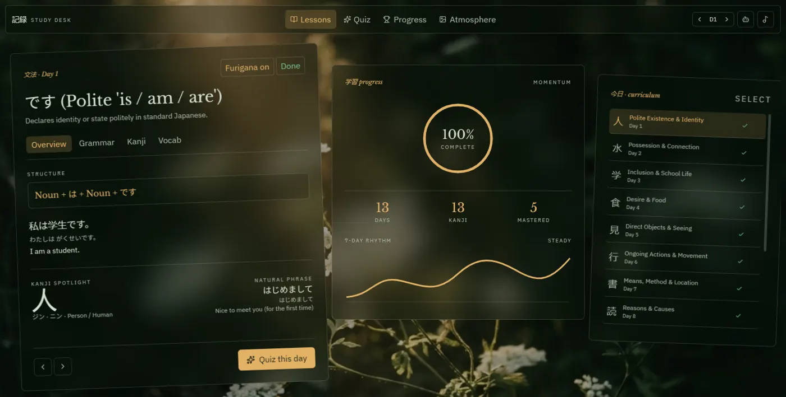

# Kiroku (記録)

> A day-by-day Japanese SRS that doesn't teach you anything — it just makes sure the AI that *does* teach you never forgets what it already covered.

**GitHub →** [github.com/late-shine/Kiroku](https://github.com/late-shine/Kiroku) · **Live app →** [usekiroku.vercel.app](https://usekiroku.vercel.app/)

**Status:** Active personal project. Everything under [What it does](#what-it-does) is built and has been tried in the real running app. What isn't built yet is in the [Roadmap](#roadmap).



If you know a little Japanese: 記録 (*kiroku*) means "record." That wasn't a branding decision — it's just what the app is. (It was called Komorebi, 木漏れ日, until the rebrand on September 30.) It doesn't correct your grammar or grade your speaking. It remembers.

---

## The Story

This didn't start as a plan. It started as a worry.

I'm learning Japanese with ChatGPT, following a 6-part daily lesson structure — the same one Kiroku stores now. I'd already built Astra-chan by this point, and it's good, genuinely — but for the actual day-to-day of being taught by an AI, it worked more like a bonus feature. The real learning was happening in an ordinary, ever-growing ChatGPT conversation.

I was on Day 13 when I got nervous. The conversation had been stretching on for a while, and the thought hit me: what if ChatGPT quietly forgets Day 3's grammar by the time we're on Day 20? Long conversations drift. So I copied out everything I'd learned so far and took it to Grok, just to get a quick `.md` file out of it — somewhere to keep the lessons that wasn't the chat itself.

The plan, at first, was small: keep updating that one markdown file, and paste the whole thing back into ChatGPT every five lessons or so, just to keep it honest about what it had and hadn't taught me.

Then the thought came back, bigger: *"What if I just made this a simple HTML file? Not something big — just enough to replay the quiz in a calm atmosphere?"* Astra-chan already did something close to that. But it didn't have quite this — the exact words, the exact day-by-day shape I was actually using with ChatGPT.

So I asked Claude to build something. Gave it some details. It made me something simple — and honestly, it wasn't very impressive. I already had Astra-chan's feature set in my head, so the bar was higher than it should've been for a first pass.

From there I went to Google AI Studio and rebuilt it with more systems and more ideas. Downloaded that zip, handed it to Lovable, and told it to redesign the whole thing from scratch. It did — simple, a little better. I took that same zip to a second Lovable session and asked for another redesign: better design, transparent glass panels, specific fonts, how the toggles should look.

All of that happened in one day.

This README picks up on day two. That's where Kiroku stopped being a from-scratch build and became a debugging-and-fixing project instead, one phase and one message-limit at a time. It reached GitHub and Vercel on October 4.

## Why This Exists

I'm a CST diploma student from Bangladesh, working toward KOSEN admission and a longer path toward Japan. Astra-chan exists because my friend Ashraful once said, basically in passing, "Claude can add sound effects and stuff it seems." That was the whole spark — I built Astra-chan alone from there. He went and built his own separate Japanese-learning app around the same time, and since then we've just been borrowing ideas off each other's apps, not building them together.

Kiroku is the same kind of solo, accidental thing, just smaller and more selfish in scope: I was actually learning Japanese, today, and got scared the AI teaching me would forget what it had already taught.

Kiroku doesn't try to be a second Astra-chan. It doesn't teach anything. It's the notebook: the thing that remembers what any AI has already covered, writes the next prompt so that AI doesn't repeat itself or skip ahead, and turns whatever comes back into a saved lesson you can quiz and review. The AI is still the teacher. Kiroku just makes sure it doesn't forget.

The difference from Astra-chan, in one line: Astra drills cards. Kiroku feeds the words you're due to review back into your AI's *next lesson*.

---

## What it does

### The loop: build a prompt, learn, paste it back

1. **Build a prompt** in the AI Lesson Studio (the robot button in the header). Pick the day, a tone (Gentle & Cozy, Strict Sensei, Casual Japanese Friend, Anime / Manga Companion), a JLPT level (N5, N4 or N3), how many vocab words (5, 10 or 15), a lesson focus, romaji on or off, and an optional custom focus.
2. **Paste it into any AI** — ChatGPT, Claude, Gemini, whichever you like. The prompt already carries everything you've saved (grammar, kanji, vocab, the words you found hard), so the AI can't repeat itself or assume something you haven't learned.
3. **Paste the reply back.** Kiroku finds the structured block in it, checks it, shows you a preview, and saves it as a new day. Nothing is saved until you confirm.

There are three modes:

- **Learn + Save** (recommended) — the AI teaches a normal, readable lesson, then adds a small block at the end for Kiroku. Paste the whole reply back.
- **Learn only** — just the lesson, no block. Good for follow-up questions before you save anything.
- **Save only** — turns a lesson you already learned into Kiroku's format. You paste the lesson text in first, because a fresh AI chat can't remember it, and the prompt tells the AI to stop and ask rather than invent one.

No account or API key is required for any of this. Manual copy and paste is the permanent default.

**Optional accounts and sync.** Kiroku is local-first, but you can optionally sign in with Google and sync across devices when Firebase is configured. The first sync offers **Merge**, **Use my account's data** or **Use this device's data**; after that, automatic sync runs on app start, when the tab regains focus, when the connection returns and after local changes. **Sync now** and **Choose how to sync…** remain available. Sync includes lessons, completed days, stars and weak-word state, review memory, quiz counters, and selected display preferences. The Gemini key, music, active quiz state and voice choice stay on the device. Restoring a backup adds to the account; it does not delete account-only days.

**Optional Gemini help.** If you add your own Gemini API key, two buttons appear: *Fix with Gemini* repairs a reply that failed the check, and *Save with Gemini* does the Save-only step for you from pasted lesson text. Free-tier models are often busy, so Kiroku tries a chain of five in turn (45 seconds each) and shows you the trail. The result still goes through the same preview before anything is saved.

### Lessons

Each day has six parts — grammar, kanji, vocab, a natural phrase, a pattern and a culture corner — shown across Overview, Grammar, Kanji and Vocab tabs. There's a furigana toggle, on'yomi and kun'yomi on every kanji, a Listen button, and "Mark done" for finished days.

You can delete a day, select several and delete them together, or reset everything (you type "reset" to confirm). A new visitor starts empty and sees a welcome panel that explains the loop, not a sample course.

### Quiz and review

A quiz is a **round** — 10 words, 20, or all of them — and it ends with a score, the words you missed and a *Retry missed* button. Pick the scope: This day, All days, a Day range, or **Due today**.

Every answer updates a small record for that word. It's a Leitner system: five boxes, with gaps of 1, 3, 7, 14 and 30 days. A wrong answer sends the word back to box 1. A right answer only moves it up a box if the word was actually due, so quizzing "All days" can't rush words up the ladder. A word in the top box counts as mastered, and your own star ("I already know this") works as a manual override.

**Nothing is due until you say so.** A word enters review when you add it (the + on a word, or *Add this day's words to review* on the Vocab tab), answer it in any quiz, or miss it. Restoring a backup doesn't dump a wall of cards on you. The Quiz tab shows a small due badge, and a Due today round asks the most overdue words first.

**Questions get harder as a word climbs.** Boxes 1–2 ask you to pick the meaning, box 3 asks you to choose the Japanese word, and boxes 4–5 ask you to type the reading in kana (katakana is accepted for hiragana; romaji isn't). A *Question style* row lets you force one style in any scope — "Choose the word" is the way out if you don't have a Japanese keyboard.

**The review reaches into your next lesson.** When you build the next Learn prompt, up to 10 due words from earlier days (most overdue first) go in with a note asking the AI to use them again in the new lesson's example sentences and phrases. The spaced repetition happens inside real lessons, which a flashcard deck can't do. (Save only never gets this section.)

### Progress and backup

The Progress tab shows your days, mastered words, quizzes and a searchable word list. **Export** saves `kiroku-backup.json` — versioned (currently v2), with your lessons, progress and review records. **Restore** checks the file first, tells you what's in it, and asks before replacing anything; a damaged or too-new file is refused and changes nothing. Older backups from before versions still restore. Music settings, the voice choice and your Gemini key are never in the file.

### Atmosphere, music and voice

- **Atmosphere:** four background scenes with a reading-contrast slider.
- **Music:** an 8-song player in the corner. Every song comes in slowed, normal and sped-up versions, switching speed keeps your place, and shuffle randomizes the speed as well as the song. It has its own volume and loop.
- **Voice:** pick which Japanese voice your browser uses for the Listen buttons, with a short sample when you tap one. The list comes from your browser and operating system, so it differs from device to device.

### Help when you're new

Besides the welcome panel, there are small dismissible tip cards on the Quiz, Progress and Atmosphere tabs and inside the Lesson Studio, and a **?** button in the header that explains the Studio flow any time. "Show tips again" brings them back.

---

## Your data and your key

- **Local-first by default.** Without Firebase configuration, lessons and progress live in your browser's `localStorage`. Clear your browser data and they're gone, so export a backup now and then.
- **Optional Firebase sync.** A signed-in account can sync lessons, progress and selected display preferences between devices. The Firebase web configuration is public by design; access is protected by `firebase/database.rules.json`, which must be published in the Firebase console.
- **Your Gemini key (optional) stays in your browser.** The app's one server function relays each request to Google and is built not to store or log the key. The key is never part of a backup, and it's never in the code.

## Known limits

- Without a configured, signed-in account, everything is per browser. Sync is not a live realtime feed: another device's changes arrive on app start, tab focus, reconnect, or the next local change.
- Voices depend on what your browser and OS provide, and the selected voice is intentionally per device. Typing readings needs a Japanese keyboard (or switch the Question style to "Choose the word").
- Free-tier Gemini models get busy and have daily limits; the fallback chain helps but can't promise an answer.

---

## Tech Stack

| Layer | Technology |
|---|---|
| Frontend | TanStack Start (React 19 + TypeScript), built with Vite 8 |
| Styling | Tailwind CSS v4, shadcn/ui + Radix primitives |
| Validation | Zod |
| Icons | lucide-react |
| Server | Nitro (Vercel preset); one server function relays the optional Gemini calls |
| Storage | Browser localStorage by default; optional Firebase Realtime Database sync |
| AI | Any chat AI by copy and paste; optional Google Gemini, bring-your-own-key |
| Hosting | Vercel, deployed from GitHub |
| Package manager | npm |

---

## How it was built

Same honest answer as Astra-chan: I didn't write the code, and there was no senior-engineer workflow behind any of this at the start. Most of it was "huh, what does this tool even do" followed immediately by using it for something real. The models wrote the code. What stayed with me was deciding what was worth building, using the real app, and noticing what nobody had asked about.

A few of those moments, because they're the actual work:

- **The prompt only asked for JSON.** Early on, the prompt Kiroku generated just asked the AI for a data block. Paste that into ChatGPT and you'd get a file meant for Kiroku, not a lesson you could read. The models built what I'd asked for, and none of them noticed. That became Learn + Save.
- **Save only trusted a chat that didn't exist.** It told the AI to convert "the lessons you wrote above", but a fresh chat has nothing above. That's why Save only now takes the lesson text, and why the prompt tells the AI to stop and ask instead of inventing one. (Given a chat that never taught that day, ChatGPT declined and asked for the text, which is the point.)
- **The quiz had no end.** It repeated the same questions and remembered nothing. No model brought that up; I did. That turned into rounds, per-word memory, Due today and the harder question types.
- **The wall of 130 cards.** The first review mode counted every untouched word as due, so restoring 13 days showed "Due today · 130." I suggested that words should join review only when you add them, which is also what keeps Kiroku from being a second Astra-chan.
- **Tips.** I borrowed the idea from how Google and similar products introduce themselves: small hints you can dismiss. Kiroku is easy if you know the system and confusing if you don't, especially the AI-prompt step.
- **Things only real use finds.** Delete freezing the page, a dropdown that opened as an unreadable white list, and two songs whose "normal" version was named wrong all came from using the running app, not from a clean build.
- **A visual polish pass.** Glass panels, typography, navigation, vocabulary, quiz, welcome and music controls were refined without changing the lesson, review or sync model. The optional Ethereal Theme Cycle gives each scene one gentle zoom cycle before the next 24-second crossfade.
- **A safer startup pass.** Local lessons, progress and music preferences now restore after client mount, while account cleanup waits for a real sign-out. This avoids SSR hydration mismatches, protects local data during startup and keeps Firebase optional when it is not configured.

The work is split into numbered phases. Each has a written spec in `PLAN.md`, a narrow set of files, and a handoff note saying exactly what changed (kept outside this repo; see Checks). One AI session builds a phase and another checks it against the spec and runs the checks. Then I test it in the running app, with screenshots, before it goes into the real project. `context.md` holds the rules every new session must read first, because a chat isn't memory but files are. Until Phase 15 there was no git, so I kept every phase as a zip plus a recovery copy.

### Timeline

The dates come from my local handoff notes.

| Date | What landed |
|---|---|
| First days | Music player (Phase 1), AI Lesson Studio (2), day-scoped quiz and furigana (3a) |
| Sept 27 | The teach-then-save prompt with its three modes (3b) |
| Sept 28 | Gemini smart import with a fallback chain (3c) |
| Sept 28–29 | Delete a day, multi-select delete and reset (3d) |
| Sept 29 | Repo cleanup; shuffle that randomizes speed, quiz day ranges, more songs (5, 6) |
| Sept 30 | Rebrand to Kiroku, the welcome screen, the voice picker (4, 11a, 8) |
| Oct 1 | Tip cards, the Astra-chan link, versioned and validated backup (11b, 12, 13) |
| Oct 2 | Quiz rounds (14a) |
| Oct 3 | Review memory, calm intake, review words in the prompt, harder questions (14b–14d) |
| Oct 4 | Left Lovable; moved to GitHub and Vercel (15) |
| Oct 4–6 | Google sign-in, manual sync, then automatic cross-device sync (9a–9c) |
| Oct 7 | Visual polish, synchronized ethereal theme cycle, and hydration/account cleanup fixes |

### AI tools used

| Tool | Role |
|---|---|
| **ChatGPT** | My actual Japanese tutor, and one of the AIs I run Kiroku's prompts through |
| **Grok** | The very first `.md` export — the idea that started all of this |
| **Claude** | Built the first rough version; since then the main builder and verifier, in separate sessions per phase because of daily message limits |
| **Google AI Studio + Gemini** | Rebuilt the first version with more features and structure; Gemini is also the optional API behind Fix / Save with Gemini |
| **OpenAI Codex (GPT-5)** | Independent verifier: compared phase changes with the project context and handoffs, reviewed diffs, and ran targeted typecheck, lint and production-build checks before changes were applied |
| **Lovable** | Two full redesigns — the second one is the current visual style. Kiroku no longer depends on it. |

---

## Run it locally

Needs Node 20.19+ or 22.12+ (what Vite 8 asks for).

```bash
git clone https://github.com/late-shine/Kiroku.git
cd Kiroku
npm install
npm run dev        # http://localhost:8080
```

The app works without a `.env` file and stays local-only when Firebase is not configured. To enable optional Google accounts and cross-device sync locally, copy `.env.example` to `.env` and fill in these six public Firebase web-config values:

```dotenv
VITE_FIREBASE_API_KEY=
VITE_FIREBASE_AUTH_DOMAIN=
VITE_FIREBASE_PROJECT_ID=
VITE_FIREBASE_APP_ID=
VITE_FIREBASE_MESSAGING_SENDER_ID=
VITE_FIREBASE_DATABASE_URL=
```

In Firebase, enable Google sign-in, create or enable Realtime Database, and publish the repository's `firebase/database.rules.json` under Realtime Database → Rules. Add `localhost` and the deployed site domain to Authentication → Settings → Authorized domains. Restart the dev server after changing `.env`. The Account UI stays hidden when the Firebase configuration is missing. The Gemini key remains optional and is entered in the app.

Other scripts: `npm run build`, `npm run preview`, `npm run lint`, `npm run format`.

### Checks

The checks available in a clean clone are:

```bash
npx tsc --noEmit -p tsconfig.json
npm run build
npm run lint
```

`PLAN.md`, `context.md`, and the phase-specific `handoffs/` verifier scripts are working files kept outside this repository, so they are not present in a normal clone. The latest sync verification was run in that separate testing copy with the Phase 9b and 9c pure sync checks and the Phase 9c Vitest/jsdom UI check. The UI check needs temporary packages; its script header has the exact `npm install --no-save --no-package-lock` command. The 9c UI check includes the earlier 9b cases, while the two plain `tsx` checks cover the pure sync rules and Firebase rules shape.

`npm run lint` mostly reports Prettier formatting findings, because the dense files were never auto-formatted and I don't run `--fix` in the middle of feature work. It rewrites whole files.

## Deploy

Push to GitHub and connect the repo to Vercel. `npm run build` uses Nitro's `vercel` preset, which writes the whole Vercel output itself, so there's no `vercel.json`. The Gemini relay runs as a Vercel Function; its worst case, five models in a row, is about 225 seconds, and Vercel's Hobby plan allows 300.

For accounts and sync, add the same six `VITE_FIREBASE_*` variables from `.env.example` to the Vercel project's Environment Variables (Production, and Preview if wanted) before redeploying; Vite bakes them into the client build. Add the production domain to Firebase Authentication's authorized domains and publish the current `firebase/database.rules.json` in Realtime Database → Rules. Random Vercel preview URLs are not automatically authorized for Google sign-in.

Vercel refuses to build versions of TanStack Start that have a known security advisory. Phase 15 hit exactly that. The fix is to upgrade `@tanstack/react-start`, `@tanstack/react-router` and `@tanstack/router-plugin` together, then re-run the checks.

---

## Roadmap

- [x] AI Lesson Studio with three prompt modes and a day-aware prompt
- [x] Optional Gemini repair and Save-only automation with a fallback chain
- [x] Delete days (single and multi-select) and full reset
- [x] Welcome screen, tip cards and a help button
- [x] Versioned, validated backup and restore
- [x] Quiz rounds, per-word Leitner memory, Due today, calm intake
- [x] Review words carried into the next lesson prompt
- [x] Harder question types as a word moves up
- [x] Music player, voice picker, atmosphere
- [x] Leave Lovable; GitHub and Vercel
- [ ] Quiz more than vocab — kanji, grammar points and phrases
- [x] Atmosphere: optional 24-second automatic theme cycling
- [ ] Atmosphere: a few gentle particles
- [ ] A friendlier guided tour for the Lesson Studio (Next / Skip all)
- [x] Accounts: Google sign-in and automatic cross-device sync
- [ ] A bridge between Kiroku and Astra-chan, so each can suggest the other

---

## Credits

- **Fonts:** Libre Baskerville and IBM Plex Sans, via Google Fonts.
- **Built on:** TanStack Start, React, Tailwind CSS, shadcn/ui, Radix, Zod, lucide-react and Firebase (Auth and Realtime Database).
- **Backgrounds:** AI-generated images, plus a couple from Pinterest that came with no artist credit. Swap in your own under `src/assets/images/`.
- **Also by me:** [Astra-chan](https://astra-kanji-tutor.vercel.app) ([GitHub](https://github.com/late-shine/astra-chan-app)), the other Japanese-learning app. Kiroku links to it from the bottom of the Atmosphere tab.

## Built By

**Shahriya** — CST Diploma student, Bangladesh. Building this while actually using it, one day of Japanese at a time.


